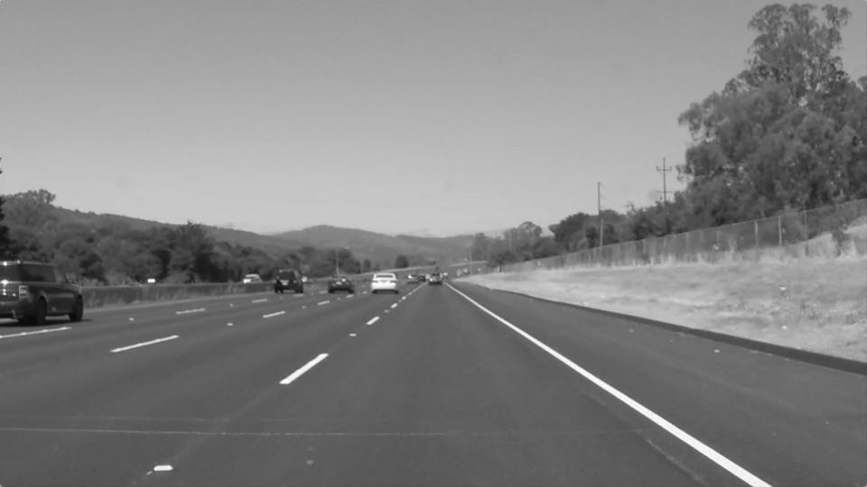
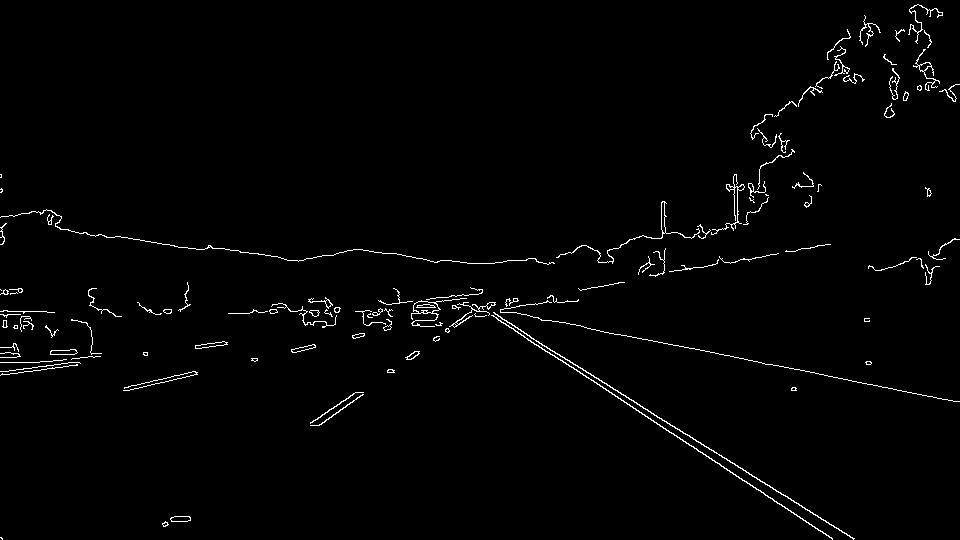
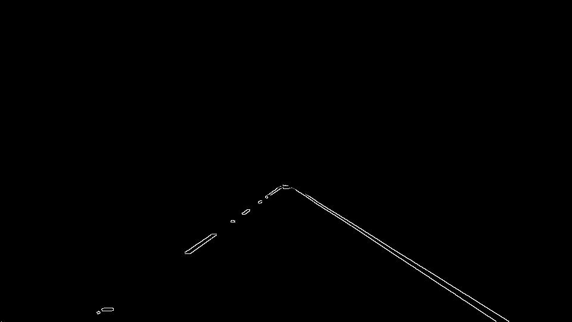
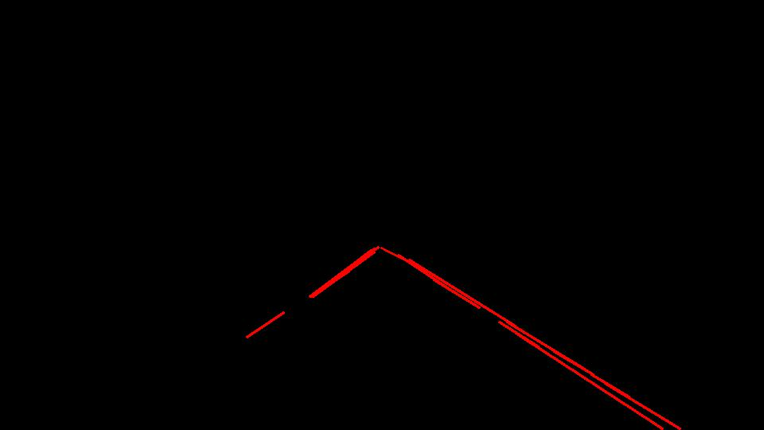
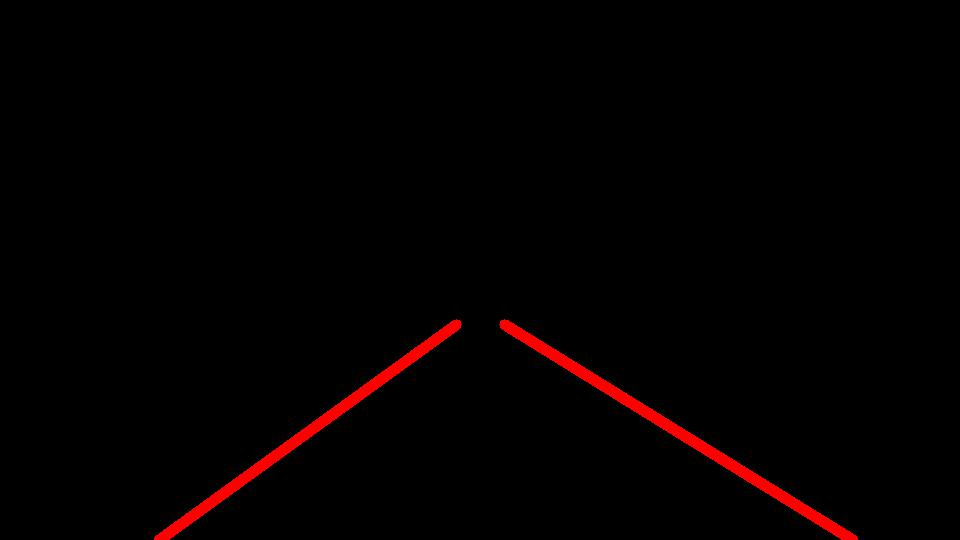
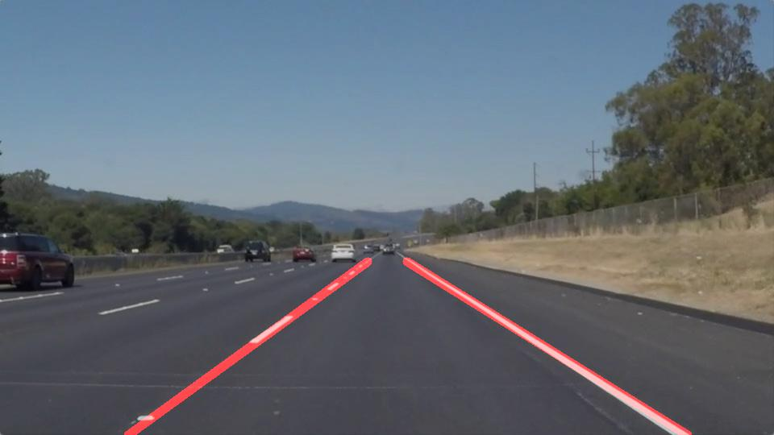

# **Finding Lane Lines on the Road** 

---

**Finding Lane Lines on the Road**

The goals / steps of this project are the following:
* Make a pipeline that finds lane lines on the road
* Reflect on your work in a written report

---

### Reflection

### 1. Describe your pipeline. As part of the description, explain how you modified the draw_lines() function.

My pipeline consisted of 5 steps. First, I converted the images to grayscale, then I applied Gaussian smoothing on the grayscale image.

Afterwards, I applied Canny edge detector on this image and got the image below:

The following image shows what it looks like after I used a mask on the image.

Then I ran Hough on edge detected image.

In order to draw a single line on the left and right lanes, I modified the draw_lines() function by introducing two functions: average_slope_intercept and convert_line_points. The first function average_slope_intercept is used to get two single lines -one on the left and the other on the right - by averaging and extrapolating identified lines. Afterwards, I used function convert_line_points to convert each line represented in slope and intercept into pixel points. We then obtained two single lines of the Hough lines.

Finally, I drew these two lines on the original image and obtained the final image as follows.

### 2. Identify potential shortcomings with your current pipeline

One potential shortcoming would be what would happen when camera captures things other than the lanes, such as the head of the car or cars in front of the self driving car, then the edge of other objects will affect the accuracy of lane lines and might even distort the lane detection. 

Another shortcoming could be that the self driving car is on curved roads rather than straight roads, then our pipeline may not apply to such situation.

Also, our pipeline does not consider cases driving at night. Limited visibility conditions would negatively affect lane detection.

### 3. Suggest possible improvements to your pipeline

A possible improvement would be to create color filters that will extract whites and yellows in the image and use them to turn black any other pixels.

Another potential improvement could be to use convolutional neural network to classify traffic signals to help guide self driving cars.
